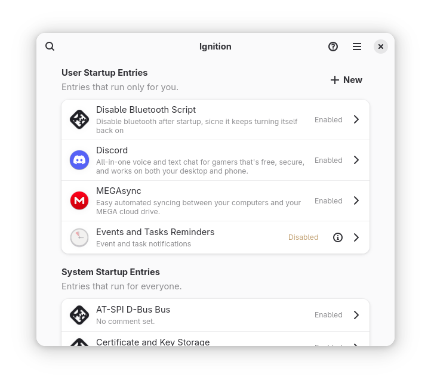

# Ignition

## Ignition is a minimal app for editing autostart entries on Freedesktop-compliant Linux distributions.



## Main Features:

1. View your startup entries
2. Create startup entries for installed apps
3. Create startup entries for saved scripts
4. Create startup entries for arbitrary commands

## Installation:

Ignition is available on Flathub! Visit your software store and search for Ignition, or click this badge.

<a href="https://flathub.org/apps/io.github.flattool.Ignition"></a>

## Translation
- Translation is hosted with Weblate on Fyra Labs, [click here](https://weblate.fyralabs.com/projects/flattool/ignition/) to contribute

<a href="https://weblate.fyralabs.com/engage/ignition/">

</a>

## Get in Contact

- We have a [Discord Server](https://discord.gg/Sq85C42Xkt) and a [Matrix Space](https://matrix.to/#/#warehouse-development:matrix.org) to discuss and send announcements in!
- You can always open issues, PRs, and use other GitHub features here

## Code of Conduct
- The Ignition project follows the [GNOME Code of Conduct](https://conduct.gnome.org/). See `CODE_OF_CONDUCT.md` for more information.

## Contributing

### Compiling from Source

> Note: NPM is *NOT* required for compiling, it is only here for formatting and linting while editing the code. It does not affect runtime *at all*.

Make sure `flatpak` and `git` are installed, then run the following to build from the repo:
```bash
# Clone this repo and enter it
git clone https://github.com/flattool/ignition
cd ignition

# Initialize submodules
git submodule update --init --recursive

# Install build dependencies
flatpak install org.flatpak.Builder org.gnome.Sdk//49 org.gnome.Platform//49 runtime/org.freedesktop.Sdk.Extension.node22//25.08 -y

# Build, install, and run Ignition
./run.sh
```

### Formatting

Ignition uses [ESLint](https://eslint.org/) for code formatting.
- Install it and its dependencies using `npm install` inside the project root
- It should work out of the box, no configuration needed
